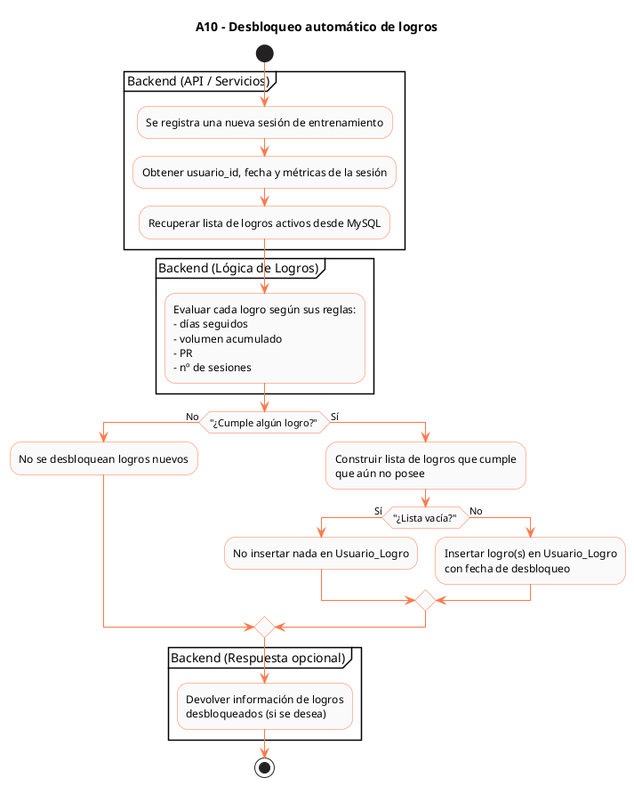

# 📘 FitTrack – Backend  
# Sprint 5 – Documentación y Modelado (Backend)

Este repositorio contiene el **Backend de FitTrack**, desarrollado con **Node.js + Express**, conectado a una arquitectura de datos híbrida:

- **MySQL** → datos estructurados (usuarios, ejercicios, logros, objetivos, FAQs, mensajes de contacto)  
- **MongoDB** → datos dinámicos y de eventos (sesiones, publicaciones, comentarios, reacciones, retos, progreso, etc.)

El backend se encarga de:

- Exponer la **API REST** consumida por el Frontend  
- Gestionar la autenticación con **JWT + bcrypt**  
- Implementar la **lógica de negocio** (retos, objetivos, logros, feed social…)  
- Acceder a las bases de datos a través de **servicios y repositorios**  
- Ejecutar procesos automáticos (actualización de progreso, desbloqueo de logros, etc.)

Este documento incluye:

- Diagrama de Casos de Uso global  
- Diagramas de Secuencia (SD1–SD12)  
- Diagramas JSON de las principales operaciones  
- Diagrama de Componentes del backend  
- Diagrama IE del modelo MySQL  

---

## 🧭 1. Relación con el Frontend

El **Frontend** de FitTrack consume todos los endpoints definidos en este backend.  
Los flujos de usuario, pantallas y wireframes están documentados en:

👉 **FitTrack Frontend:**  
https://github.com/AlbertoRD03/Albertoramirez-PI-Front

---

## 🗃️ 2. Estructura del Backend

```txt
/src
  /controllers       # Controladores (Auth, Usuarios, Sesiones, Fitgram, Retos, etc.)
  /services          # Servicios de dominio
  /repositories      # Acceso a datos (MySQL y MongoDB)
  /middlewares       # Middlewares (autenticación JWT, validaciones, etc.)
  /routes            # Definición de rutas Express
  /config            # Configuración (DB, JWT, entorno)
/docs
  /sprint5
    /usecase
    /secuencia
    /json
    /componentes
    /ie
``` 
## 🧩 3. Diagrama de Casos de Uso
### Diagrama de Casos de Uso – FitTrack

```@startuml
title FitTrack - Diagrama de Casos de Uso

left to right direction

actor "Usuario" as U

rectangle FitTrack {
  (Registrarse) as UC_Registro
  (Iniciar sesión) as UC_Login
  (Completar Onboarding) as UC_Onboarding
  (Ver Dashboard) as UC_Dashboard
  (Registrar sesión de entrenamiento) as UC_Sesion
  (Consultar calendario) as UC_Calendario
  (Crear objetivo) as UC_CrearObjetivo
  (Consultar objetivos y progreso) as UC_VerObjetivos
  (Ver logros) as UC_Logros
  (Crear publicación) as UC_CrearPost
  (Comentar publicación) as UC_Comentar
  (Dar Like) as UC_Like
  (Ver feed Fitgram) as UC_Feed
  (Unirse a un reto) as UC_UnirseReto
  (Crear reto) as UC_CrearReto
  (Editar perfil) as UC_EditarPerfil
  (Enviar mensaje de soporte) as UC_Soporte
}

U --> UC_Registro
U --> UC_Login
U --> UC_Onboarding
U --> UC_Dashboard
U --> UC_Sesion
U --> UC_Calendario
U --> UC_CrearObjetivo
U --> UC_VerObjetivos
U --> UC_Logros
U --> UC_CrearPost
U --> UC_Comentar
U --> UC_Like
U --> UC_Feed
U --> UC_UnirseReto
U --> UC_CrearReto
U --> UC_EditarPerfil
U --> UC_Soporte

@enduml
```


## 🧩 4. Diagramas de Secuencia (SD1–SD12)
A continuación se muestran los diagramas de secuencia más importantes del backend, que describen la interacción entre:

Usuario → Frontend (React) → API Backend (Node/Express) → MySQL / MongoDB

### SD1 – Registro de usuario

```@startuml
title SD1 - Registro de usuario

skinparam backgroundColor #fafafa
skinparam sequence {
  ArrowColor #ff7849
  LifeLineBorderColor #ff7849
  LifeLineBackgroundColor #ffffff
}

actor Usuario as U
participant "Frontend (React)" as FE
participant "Backend API (Node/Express)" as API
database "MySQL" as SQL

U -> FE: Abre pantalla de registro
FE -> U: Mostrar formulario (nombre, email, contraseña)

U -> FE: Enviar formulario de registro
FE -> FE: Validar datos en cliente
FE -> API: POST /auth/register {nombre, email, password}

API -> API: Validar payload
API -> SQL: SELECT * FROM Usuarios WHERE email = ?
SQL --> API: Resultado (0 o 1 fila)

alt Email ya registrado
  API --> FE: 409 Conflict (email en uso)
  FE -> U: Mostrar mensaje de error
else Email libre
  API -> API: Hashear contraseña (bcrypt)
  API -> SQL: INSERT INTO Usuarios (...)
  SQL --> API: OK
  API --> FE: 201 Created (usuario creado)
  FE -> U: Mostrar éxito y redirigir a Login
end

@enduml
```


### SD2 – Login

```@startuml
title SD2 - Login

skinparam backgroundColor #fafafa
skinparam sequence {
  ArrowColor #ff7849
  LifeLineBorderColor #ff7849
  LifeLineBackgroundColor #ffffff
}

actor Usuario as U
participant "Frontend (React)" as FE
participant "Backend API (Node/Express)" as API
database "MySQL" as SQL

U -> FE: Abre pantalla de Login
FE -> U: Mostrar formulario (email, contraseña)

U -> FE: Enviar credenciales
FE -> FE: Validar formato básico
FE -> API: POST /auth/login {email, password}

API -> SQL: SELECT * FROM Usuarios WHERE email = ?
SQL --> API: Usuario (o null)

alt Usuario no encontrado
  API --> FE: 401 Unauthorized
  FE -> U: Mostrar \"Credenciales incorrectas\"
else Usuario encontrado
  API -> API: Comparar contraseña con hash (bcrypt)
  alt Contraseña incorrecta
    API --> FE: 401 Unauthorized
    FE -> U: Mostrar \"Credenciales incorrectas\"
  else Contraseña correcta
    API -> API: Generar JWT + comprobar onboarding_pendiente
    API --> FE: 200 OK {token, onboardingCompletado}
    FE -> FE: Guardar token (localStorage, etc.)
    FE -> U: Redirigir a Onboarding o Dashboard
  end
end

@enduml
```


### SD3 – Onboarding inicial

```@startuml
title SD3 - Onboarding inicial

skinparam backgroundColor #fafafa
skinparam sequence {
  ArrowColor #ff7849
  LifeLineBorderColor #ff7849
  LifeLineBackgroundColor #ffffff
}

actor Usuario as U
participant "Frontend (React)" as FE
participant "Backend API (Node/Express)" as API
database "MySQL" as SQL

U -> FE: Accede tras primer login
FE -> U: Mostrar pasos de Onboarding\n(datos físicos, nivel, objetivo)

U -> FE: Completar datos de onboarding
FE -> FE: Validar datos
FE -> API: POST /usuarios/onboarding {datos_fisicos, nivel, objetivo}

API -> API: Validar JWT y usuario
API -> SQL: UPDATE Usuarios\nSET altura_cm=?, peso_kg=?,\n    fecha_nacimiento=?, genero=?,\n    nivel_experiencia=?, objetivo_principal=?,\n    onboarding_pendiente=false\nWHERE id_usuario = ?
SQL --> API: OK

API --> FE: 200 OK
FE -> U: Mostrar confirmación\nRedirigir a Dashboard

@enduml
```


### SD4 – Dashboard summary

```@startuml
title SD4 - Carga del Dashboard

skinparam backgroundColor #fafafa
skinparam sequence {
  ArrowColor #ff7849
  LifeLineBorderColor #ff7849
  LifeLineBackgroundColor #ffffff
}

actor Usuario as U
participant "Frontend (React)" as FE
participant "Backend API (Node/Express)" as API
database "MySQL" as SQL
database "MongoDB" as MDB

U -> FE: Accede al Dashboard
FE -> API: GET /dashboard-summary (JWT)

API -> API: Validar token y obtener usuario_id

API -> MDB: Buscar sesiones recientes\ncolección Sesiones por usuario_id
MDB --> API: Lista de sesiones

API -> SQL: Consultar próximos entrenamientos\n(si se modelan en SQL) o resumen
SQL --> API: Próxima sesión

API -> SQL: SELECT últimos logros\nFROM Usuario_Logro JOIN Logros
SQL --> API: Lista de logros recientes

API -> API: Construir DTO resumen\n{resumenSemanal, proximaSesion, logros}
API --> FE: 200 OK {resumen}

FE -> U: Mostrar dashboard con\nresumen, próxima sesión, logros

@enduml
```


### SD5 – Registrar sesión de entrenamiento

```@startuml
title SD5 - Registrar sesión de entrenamiento

skinparam backgroundColor #fafafa
skinparam sequence {
  ArrowColor #ff7849
  LifeLineBorderColor #ff7849
  LifeLineBackgroundColor #ffffff
}

actor Usuario as U
participant "Frontend (React)" as FE
participant "Backend API (Node/Express)" as API
database "MySQL" as SQL
database "MongoDB" as MDB

U -> FE: Configura sesión y ejercicios
FE -> FE: Validar datos (ejercicios, sets)
FE -> API: POST /sesiones {sesion}

API -> API: Validar payload
API -> SQL: Verificar ejercicio_id\ncontra tabla Ejercicios
SQL --> API: OK

API -> MDB: Insertar documento en Sesiones
MDB --> API: Sesión creada

API -> API: Actualizar progreso de objetivos\n(consultar Objetivos_Usuario y Progreso_Objetivo_Detalle)
API -> API: Actualizar progreso en retos\n(colección Progreso_Reto_Usuario)
API -> API: Evaluar condiciones de logros\n(ver SD10 a nivel lógico)

API --> FE: 201 Created {resumenSesion, logrosDesbloqueados?}
FE -> U: Mostrar confirmación y opciones\n(Ver sesión, Dashboard, Historial)

@enduml
```


### SD6 – Consulta de logros

```@startuml
title SD6 - Consulta de logros

skinparam backgroundColor #fafafa
skinparam sequence {
  ArrowColor #ff7849
  LifeLineBorderColor #ff7849
  LifeLineBackgroundColor #ffffff
}

actor Usuario as U
participant "Frontend (React)" as FE
participant "Backend API (Node/Express)" as API
database "MySQL" as SQL

U -> FE: Accede a \"Logros\"
FE -> API: GET /logros-usuario (JWT)

API -> API: Validar token y obtener usuario_id
API -> SQL: SELECT * FROM Logros
SQL --> API: Lista de logros

API -> SQL: SELECT * FROM Usuario_Logro\nWHERE usuario_id = ?
SQL --> API: Lista de logros desbloqueados

API -> API: Marcar cada logro como\nbloqueado/desbloqueado
API --> FE: 200 OK {logrosConEstado}

FE -> U: Mostrar logros\n(desbloqueados y pendientes)

@enduml
```


### SD7 – Feed de publicaciones (Fitgram)

```@startuml
title SD7 - Feed de Fitgram

skinparam backgroundColor #fafafa
skinparam sequence {
  ArrowColor #ff7849
  LifeLineBorderColor #ff7849
  LifeLineBackgroundColor #ffffff
}

actor Usuario as U
participant "Frontend (React)" as FE
participant "Backend API (Node/Express)" as API
database "MongoDB" as MDB
database "MySQL" as SQL

U -> FE: Abre sección Fitgram
FE -> API: GET /publicaciones?pagina=1

API -> MDB: Buscar publicaciones\nordenadas por fecha en Publicaciones
MDB --> API: Lista de publicaciones

API -> SQL: Obtener datos de usuario\nde cada usuario_id
SQL --> API: Datos básicos de autor

API -> API: Combinar publicaciones + autor\n+ contadores likes/comentarios
API --> FE: 200 OK {feed}

FE -> U: Mostrar feed con publicaciones

@enduml
```


### SD8 – Crear publicación

```@startuml
title SD8 - Crear publicación en Fitgram

skinparam backgroundColor #fafafa
skinparam sequence {
  ArrowColor #ff7849
  LifeLineBorderColor #ff7849
  LifeLineBackgroundColor #ffffff
}

actor Usuario as U
participant "Frontend (React)" as FE
participant "Backend API (Node/Express)" as API
database "MongoDB" as MDB

U -> FE: Abre \"Crear publicación\"
FE -> U: Mostrar formulario (texto, imagen, hashtags)

U -> FE: Completa y envía publicación
FE -> FE: Validar contenido
FE -> API: POST /publicaciones {contenido, hashtags, imagen?}

API -> API: Validar datos
API -> MDB: Insertar en Publicaciones
MDB --> API: OK

API --> FE: 201 Created {publicacion}
FE -> FE: Añadir publicación al feed
FE -> U: Mostrar \"Publicación creada\"

@enduml
```


### SD9 – Comentar publicación

```@startuml
title SD9 - Comentar en una publicación

skinparam backgroundColor #fafafa
skinparam sequence {
  ArrowColor #ff7849
  LifeLineBorderColor #ff7849
  LifeLineBackgroundColor #ffffff
}

actor Usuario as U
participant "Frontend (React)" as FE
participant "Backend API (Node/Express)" as API
database "MongoDB" as MDB

U -> FE: Escribir comentario
FE -> FE: Validar comentario (no vacío)
FE -> API: POST /comentarios {publicacion_id, texto}

API -> API: Validar datos
API -> MDB: Insertar en Comentarios
MDB --> API: OK

API -> MDB: (Opcional) Incrementar contador\ncomentarios en Publicaciones
MDB --> API: OK

API --> FE: 201 Created {comentario}
FE -> FE: Añadir comentario al listado
FE -> U: Mostrar comentario publicado

@enduml
```


### SD10 – Like / Quitar like en publicación

```@startuml
title SD10 - Dar / quitar like en publicación

skinparam backgroundColor #fafafa
skinparam sequence {
  ArrowColor #ff7849
  LifeLineBorderColor #ff7849
  LifeLineBackgroundColor #ffffff
}

actor Usuario as U
participant "Frontend (React)" as FE
participant "Backend API (Node/Express)" as API
database "MongoDB" as MDB

U -> FE: Pulsa icono de like
FE -> FE: Determinar acción (like o quitar like)

alt Dar like
  FE -> API: POST /reacciones {publicacion_id}
  API -> API: Validar usuario y publicación
  API -> MDB: Insertar en Reacciones
  MDB --> API: OK
  API -> MDB: Actualizar contador likes
  MDB --> API: OK
  API --> FE: 200 OK {totalLikes}
  FE -> U: Mostrar like activo y contador
else Quitar like
  FE -> API: DELETE /reacciones/{id_reaccion}
  API -> MDB: Eliminar de Reacciones
  MDB --> API: OK
  API -> MDB: Actualizar contador likes
  MDB --> API: OK
  API --> FE: 200 OK {totalLikes}
  FE -> U: Mostrar like inactivo y contador
end

@enduml
```


### SD11 – Unirse a un reto

```@startuml
title SD11 - Unirse a un reto

skinparam backgroundColor #fafafa
skinparam sequence {
  ArrowColor #ff7849
  LifeLineBorderColor #ff7849
  LifeLineBackgroundColor #ffffff
}

actor Usuario as U
participant "Frontend (React)" as FE
participant "Backend API (Node/Express)" as API
database "MongoDB" as MDB

U -> FE: Abre detalle de reto
FE -> U: Mostrar info del reto

U -> FE: Pulsa \"Unirse al reto\"
FE -> API: POST /retos/{id}/join

API -> API: Validar JWT y reto
API -> MDB: Buscar Progreso_Reto_Usuario\npara usuario y reto
MDB --> API: Resultado

alt Ya participa
  API --> FE: 200 OK {yaParticipa}
  FE -> U: Mostrar mensaje informativo
else No participa
  API -> MDB: Insertar nuevo Progreso_Reto_Usuario\n(progreso_inicial=0)
  MDB --> API: OK
  API --> FE: 201 Created {progreso}
  FE -> U: Mostrar \"Te has unido al reto\"
end

@enduml
```


### SD12 – Actualización automática de progreso en retos

```@startuml
title SD12 - Actualización automática de progreso en retos

skinparam backgroundColor #fafafa
skinparam sequence {
  ArrowColor #ff7849
  LifeLineBorderColor #ff7849
  LifeLineBackgroundColor #ffffff
}

actor Usuario as U
participant "Frontend (React)" as FE
participant "Backend API (Node/Express)" as API
database "MongoDB" as MDB

U -> FE: Registra una sesión (ver SD5)
FE -> API: POST /sesiones {sesion}

API -> MDB: Insertar documento en Sesiones
MDB --> API: OK

API -> MDB: Buscar retos activos del usuario\n(Progreso_Reto_Usuario + Retos)
MDB --> API: Lista de retos

API -> API: Calcular cuánto suma la sesión\na cada reto (reps, km, etc.)
API -> MDB: Actualizar Progreso_Reto_Usuario\npara cada reto
MDB --> API: OK

API --> FE: 201 Created {sesion, progresoRetos?}
FE -> U: Progreso de retos se refleja\ncuando consulta la sección de Retos

@enduml
```


## 🧩 5. Diagramas JSON (estructura de datos y API)
A continuación se muestran algunos de los JSON más representativos del backend.
Cada uno está modelado con @startjson / @endjson
en PlantUML.

### JSON – Login Request

```@startjson
{
  "email": "usuario@fittrack.com",
  "password": "ClaveSegura123!"
}
@endjson
```

.svg)


### JSON – Login Response

```@startjson
{
  "token": "jwt-token-aqui",
  "tokenType": "Bearer",
  "expiresIn": 3600,
  "user": {
    "id": 123,
    "nombre": "Alberto",
    "email": "usuario@fittrack.com",
    "onboardingCompletado": true
  }
}
@endjson
```

.svg)


### JSON – Crear sesión de entrenamiento (POST /sesiones)

```@startjson
{
  "usuario_id": 123,
  "fecha": "2025-11-28",
  "tipo": "Fuerza - Pecho",
  "notas": "Hoy me he encontrado muy bien",
  "ejercicios_realizados": [
    {
      "ejercicio_id": 10,
      "nombreEjercicio": "Press banca",
      "sets": [
        { "reps": 10, "peso": 60 },
        { "reps": 8, "peso": 70 },
        { "reps": 5, "peso": 80 }
      ]
    },
    {
      "ejercicio_id": 22,
      "nombreEjercicio": "Aperturas mancuernas",
      "sets": [
        { "reps": 12, "peso": 16 },
        { "reps": 12, "peso": 16 }
      ]
    }
  ]
}
@endjson
```

.svg)


### JSON – Publicación (colección Publicaciones – MongoDB)

```@startjson
{
  "_id": "675abc123def456789012345",
  "usuario_id": 123,
  "contenido_texto": "Primer día de pecho serio 💪 #fittrack",
  "imagen_url": "https://cdn.fittrack.com/posts/123.jpg",
  "hashtags": [
    "fittrack",
    "pecho",
    "gimnasio"
  ],
  "fecha_creacion": "2025-11-28T18:35:00Z",
  "contador_likes": 12,
  "contador_comentarios": 4
}
@endjson
```

.svg)


### JSON – Reto y Progreso_Reto_Usuario

```@startjson
{
  "_id": "ret_300flex_2025",
  "nombre": "300 flexiones en 30 días",
  "descripcion": "Completa 300 flexiones acumuladas en 30 días.",
  "regla": {
    "tipo": "acumulativo",
    "actividad": "flexiones",
    "objetivo_total": 300,
    "unidad": "reps"
  },
  "fecha_inicio": "2025-12-01",
  "fecha_fin": "2025-12-30",
  "creado_por_usuario_id": 123
}
@endjson
```


```@startjson
{
  "_id": "prog_300flex_123",
  "reto_id": "ret_300flex_2025",
  "usuario_id": 123,
  "progreso_actual": 120,
  "objetivo_total": 300,
  "porcentaje": 40,
  "fecha_union": "2025-12-01",
  "ultimo_update": "2025-12-10T19:00:00Z"
}
@endjson
```


### JSON – Objetivo y Progreso_Objetivo_Detalle

```@startjson
{
  "id": 45,
  "usuario_id": 123,
  "tipo": "peso",
  "descripcion": "Bajar a 80 kg",
  "valor_inicial": 90,
  "valor_objetivo": 80,
  "valor_actual": 87,
  "unidad": "kg",
  "fecha_creacion": "2025-11-01",
  "fecha_limite": "2026-02-01"
}
@endjson
```


```@startjson
{
  "_id": "prog_obj_45_20251128",
  "objetivo_id": 45,
  "usuario_id": 123,
  "fecha_registro": "2025-11-28",
  "valor": 87,
  "nota": "Semana fuerte, buena dieta"
}
@endjson
```


## 🧩 6. Diagrama de Componentes (Backend)

```@startuml
title Diagrama de Componentes - Arquitectura Backend FitTrack

skinparam backgroundColor #fafafa
skinparam componentStyle rectangle
skinparam component {
  BorderColor #ff7849
  BackgroundColor white
}
skinparam package {
  BorderColor #ff7849
}

package "Backend (Node/Express API)" {

  [Express App / Router] as BE_Express

  package "Controladores (APIs)" {
    [Auth API] as API_Auth
    [Usuarios API] as API_Usuarios
    [Sesiones API] as API_Sesiones
    [Objetivos API] as API_Objetivos
    [Logros API] as API_Logros
    [Fitgram API] as API_Fitgram
    [Retos API] as API_Retos
    [Soporte API] as API_Soporte
  }

  package "Servicios de Dominio" {
    [AuthService] as S_Auth
    [UsuarioService] as S_Usuario
    [SesionService] as S_Sesion
    [ObjetivoService] as S_Objetivo
    [LogroService] as S_Logro
    [FitgramService] as S_Fitgram
    [RetoService] as S_Reto
    [SoporteService] as S_Soporte
  }

  package "Repositorios (Acceso a datos)" {
    [UsuariosRepo] as R_Usuarios
    [EjerciciosRepo] as R_Ejercicios
    [LogrosRepo] as R_Logros
    [ObjetivosUsuarioRepo] as R_ObjetivosUsuario
    [FAQsRepo] as R_FAQ
    [MensajesContactoRepo] as R_Contacto

    [SesionesRepo] as R_Sesiones
    [PublicacionesRepo] as R_Publicaciones
    [ComentariosRepo] as R_Comentarios
    [ReaccionesRepo] as R_Reacciones
    [RetosRepo] as R_Retos
    [ProgresoRetoUsuarioRepo] as R_ProgReto
    [ProgresoObjetivoDetalleRepo] as R_ProgObjetivo
  }

  [Middleware Auth (JWT)] as BE_MiddlewareAuth

  BE_Express --> API_Auth
  BE_Express --> API_Usuarios
  BE_Express --> API_Sesiones
  BE_Express --> API_Objetivos
  BE_Express --> API_Logros
  BE_Express --> API_Fitgram
  BE_Express --> API_Retos
  BE_Express --> API_Soporte

  BE_Express --> BE_MiddlewareAuth
  BE_MiddlewareAuth --> API_Usuarios
  BE_MiddlewareAuth --> API_Sesiones
  BE_MiddlewareAuth --> API_Objetivos
  BE_MiddlewareAuth --> API_Logros
  BE_MiddlewareAuth --> API_Fitgram
  BE_MiddlewareAuth --> API_Retos
  BE_MiddlewareAuth --> API_Soporte

  API_Auth --> S_Auth
  API_Usuarios --> S_Usuario
  API_Sesiones --> S_Sesion
  API_Objetivos --> S_Objetivo
  API_Logros --> S_Logro
  API_Fitgram --> S_Fitgram
  API_Retos --> S_Reto
  API_Soporte --> S_Soporte

  S_Auth --> R_Usuarios
  S_Usuario --> R_Usuarios
  S_Sesion --> R_Sesiones
  S_Sesion --> R_Ejercicios
  S_Objetivo --> R_ObjetivosUsuario
  S_Objetivo --> R_ProgObjetivo
  S_Logro --> R_Logros
  S_Logro --> R_Usuarios
  S_Fitgram --> R_Publicaciones
  S_Fitgram --> R_Comentarios
  S_Fitgram --> R_Reacciones
  S_Reto --> R_Retos
  S_Reto --> R_ProgReto
  S_Soporte --> R_Contacto
  S_Soporte --> R_FAQ
}

database "MySQL" as DB_SQL
database "MongoDB" as DB_MDB

R_Usuarios --> DB_SQL
R_Ejercicios --> DB_SQL
R_Logros --> DB_SQL
R_ObjetivosUsuario --> DB_SQL
R_FAQ --> DB_SQL
R_Contacto --> DB_SQL

R_Sesiones --> DB_MDB
R_Publicaciones --> DB_MDB
R_Comentarios --> DB_MDB
R_Reacciones --> DB_MDB
R_Retos --> DB_MDB
R_ProgReto --> DB_MDB
R_ProgObjetivo --> DB_MDB

@enduml
```


## 🧩 7. Diagrama IE – Modelo MySQL

```@startuml
title Diagrama IE - Modelo de datos principal (MySQL) - FitTrack

skinparam backgroundColor #fafafa
skinparam class {
  BackgroundColor white
  BorderColor #ff7849
}

entity "Usuarios" as usuarios {
  * id_usuario : INT <<PK>>
  --
  nombre : VARCHAR(100)
  email : VARCHAR(150) <<UNIQUE>>
  password_hash : VARCHAR(255)
  fecha_nacimiento : DATE
  genero : ENUM('M','F','O')
  altura_cm : INT
  peso_kg : DECIMAL(5,2)
  nivel_experiencia : ENUM('principiante','intermedio','avanzado')
  objetivo_principal : VARCHAR(255)
  onboarding_pendiente : BOOLEAN
  fecha_registro : DATETIME
}

entity "Ejercicios" as ejercicios {
  * id_ejercicio : INT <<PK>>
  --
  nombre : VARCHAR(100)
  grupo_muscular : VARCHAR(100)
  descripcion : TEXT
  equipamiento : VARCHAR(100)
  nivel : ENUM('principiante','intermedio','avanzado')
  activo : BOOLEAN
}

entity "Logros" as logros {
  * id_logro : INT <<PK>>
  --
  nombre : VARCHAR(100)
  descripcion : TEXT
  codigo_condicion : VARCHAR(100)
  tipo : VARCHAR(50)
  umbral : INT
  activo : BOOLEAN
}

entity "Usuario_Logro" as usuario_logro {
  * id_usuario_logro : INT <<PK>>
  --
  usuario_id : INT <<FK>>
  logro_id : INT <<FK>>
  fecha_desbloqueo : DATETIME
}

entity "Objetivos_Usuario" as objetivos_usuario {
  * id_objetivo : INT <<PK>>
  --
  usuario_id : INT <<FK>>
  tipo : VARCHAR(50)
  descripcion : VARCHAR(255)
  valor_inicial : DECIMAL(7,2)
  valor_objetivo : DECIMAL(7,2)
  valor_actual : DECIMAL(7,2)
  unidad : VARCHAR(20)
  estado : ENUM('en_progreso','completado','cancelado')
  fecha_creacion : DATETIME
  fecha_limite : DATE
}

entity "FAQs" as faqs {
  * id_faq : INT <<PK>>
  --
  pregunta : VARCHAR(255)
  respuesta : TEXT
  categoria : VARCHAR(100)
  orden : INT
  activo : BOOLEAN
}

entity "Mensajes_Contacto" as mensajes_contacto {
  * id_mensaje : INT <<PK>>
  --
  usuario_id : INT <<FK>>
  email : VARCHAR(150)
  asunto : VARCHAR(150)
  mensaje : TEXT
  fecha_envio : DATETIME
  estado : ENUM('pendiente','en_proceso','resuelto')
}

usuarios::id_usuario ||--o{ objetivos_usuario::usuario_id
usuarios::id_usuario ||--o{ usuario_logro::usuario_id
logros::id_logro ||--o{ usuario_logro::logro_id
usuarios::id_usuario ||--o{ mensajes_contacto::usuario_id

@enduml
```


---

## 🧩 8. Diagrama de Actividad
---


Este diagrama representa la lógica **interna del backend** que se ejecuta cuando se registra una sesión de entrenamiento.  
No participa el usuario ni el frontend: es un flujo *100% automático* que vive en el servidor.

Cuando se guarda una nueva sesión (ver SD5), el backend:

- Calcula si el usuario cumple condiciones de algún logro  
- Verifica logros activos en la tabla `Logros`  
- Comprueba si el usuario ya tiene ese logro asociado  
- Inserta el logro en `Usuario_Logro` si corresponde  
- Opcionalmente devuelve los logros desbloqueados al frontend

### A10 – Desbloqueo automático de logros




## 🔗 9. Actividades documentadas en el Frontend

Las actividades relacionadas con la **interacción del usuario**, como pantallas, navegación, validaciones en cliente y flujos UI, están completamente documentadas en el repositorio del Frontend.

Estas actividades incluyen, entre otras:

- A1 – Registro de usuario  
- A2 – Inicio de sesión  
- A3 – Recuperación de contraseña  
- A4 – Onboarding inicial  
- A5 – Navegación desde el Dashboard  
- A6 – Registrar sesión (parte de UI)  
- A7 – Consultar calendario  
- A8 – Crear objetivo personal  
- A11 – Crear publicación (Fitgram)  
- A12 – Comentar / Like  
- A13 – Unirse a un reto  
- A14 – Crear reto  
- A15 – Editar perfil  
- A16 – Enviar mensaje de soporte  

Estas actividades **no forman parte del backend**, ya que describen únicamente comportamiento del **frontend**, validaciones de interfaz y navegación del usuario.

Para consultarlas:

👉 **FitTrack Frontend:**  
https://github.com/AlbertoRD03/Albertoramirez-PI-Front
